# Procesverslag
Markdown is een simpele manier om HTML te schrijven.  
Markdown cheat cheet: [Hulp bij het schrijven van Markdown](https://github.com/adam-p/markdown-here/wiki/Markdown-Cheatsheet).

Nb. De standaardstructuur en de spartaanse opmaak van de README.md zijn helemaal prima. Het gaat om de inhoud van je procesverslag. Besteedt de tijd voor pracht en praal aan je website.

Nb. Door *open* toe te voegen aan een *details* element kun je deze standaard open zetten. Fijn om dat steeds voor de relevante stuk(ken) te doen.

## Jij

  
uitwerken voor kick-off werkgroep

  ### Auteur:
  Ceren Coban
  #### Je startniveau:
  Blauw

  #### Je focus:
  Responsive
 

## Je website

  
Uitwerken voor kick-off werkgroep

   https://www.universiteitvannederland.nl/ Home pagina & Doneren pagina
  ### Je opdracht:

  #### Screenshot(s) van de eerste pagina (small screen): 
  Home pagina
    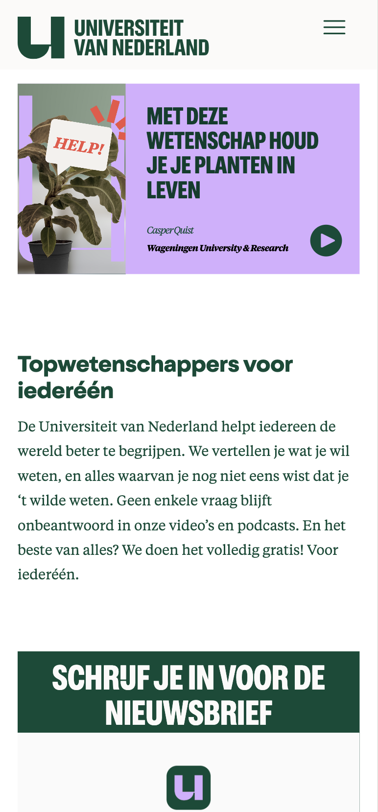
    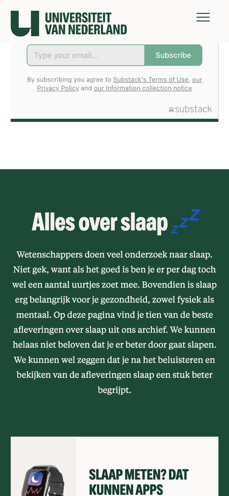
    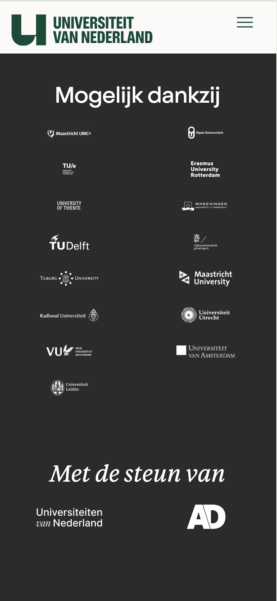
    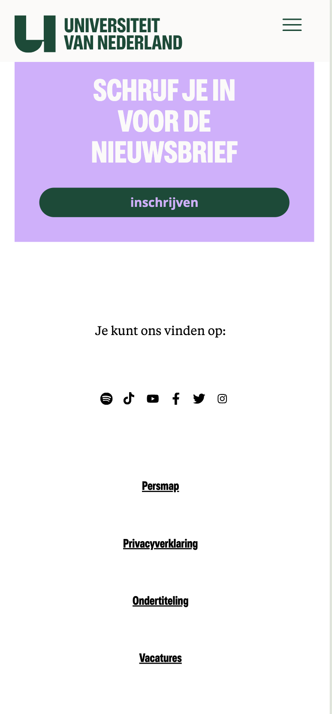
 :

  #### Screenshot(s) van de tweede pagina (small screen):
  Doneren pagina
    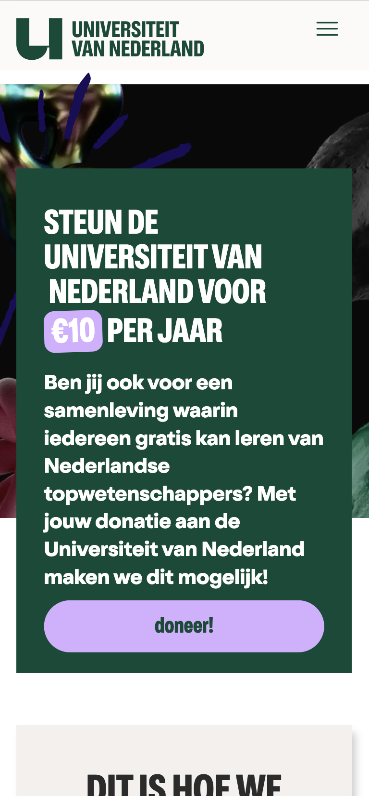
    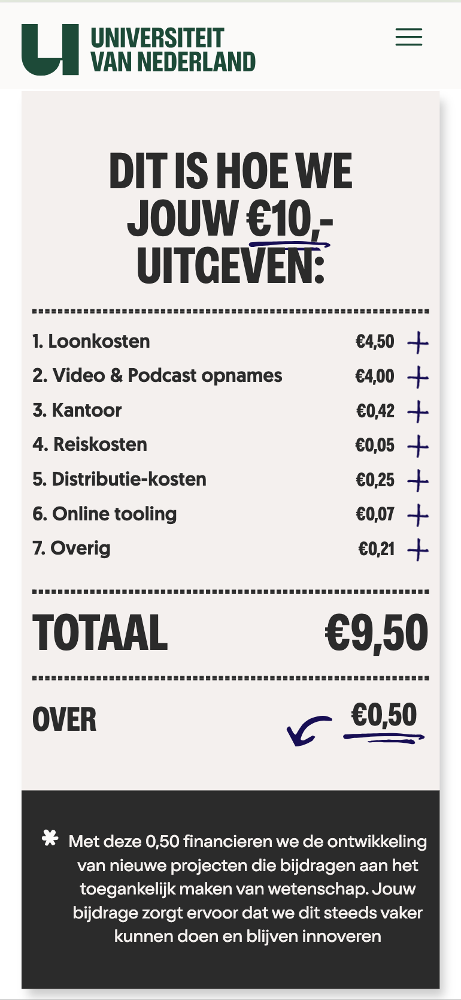
    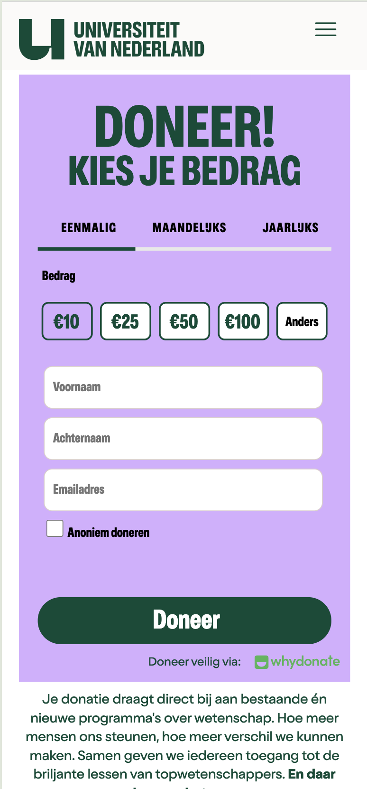
    

## Toegankelijkheidstest 1/2 (week 1)

  
uitwerken na test in 2e werkgroep

  ### Bevindingen
  1. De website ondersteunt geen hoge contrast of licht/donkere modus.
  2. Kleur wordt soms als enige manier gebruikt om informatie over te brengen.
  3. Hoewel de website geen heftige animaties bevat, zou het fijn zijn om gebruik van prefers-reduced-motion te maken.
  4. In theorie worden er een H1 en meerdere H2 tags gebruik gemaakt, maar h1 en h2 hebben dezelfde functie en er zijn geen verschil ivm de functies. 
  5. Podcasts hebben geen ondertiteling, videos wel. 
  6. Niet alle interactieve elementen hebben een duidelijke focus-staat.
  7. Geen skip link (ga naar de inhoud knop)
  8. Focusstijl is niet altijd zichtbaar. 
  9. Horizontaal scrollen is vermijderd, maar je ziet nog steeds een beetje witte ruimte.
  10. Afbeeldingen hebben geen alternatieve tekst.

## Breakdownschets (week 1)

  
uitwerken na afloop 3e werkgroep

  ### de hele pagina: 
  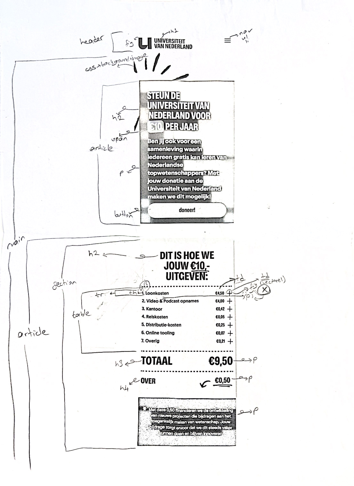
  

  ### dynamisch deel (bijv menu): 
  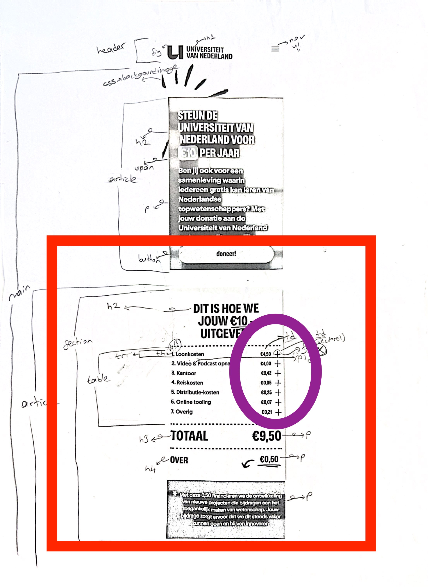
  In de tabel zit een extra rij waar je meer info kunt tonen. Ik kan dit met 'details' doen, maar waarschijnlijk gebruik ik een button om het uit te klappen.

  ### wellicht nog een dynamisch deel (bijv filter): 
  
  De mobiele versie bevat een hamburger menu.

## Voortgang 1 (week 2)

  
uitwerken voor 1e voortgang

  ### Stand van zaken
  Table element ken ik niet. Eerste keer ga ik aan de slag gaan. 
  Ik had ze als losse sections gemaakt, maar ze horen eigenlijk allemaal bij de donatie. Dus het moet gewoon één section zijn.

  ### Agenda voor meeting
  samen met je groepje opstellen

  | Ceren           | student 2          | student 3    | student 4        |
  | ---            | ---                | ---          | ---              |
  | -Toegankelijkheid & kopjes| en dit             | en ik dit    | en dan ik dat    |
  | -Flexbox oefening 4 - Carousel | dit als er tijd is | nog een punt | dit wil ik zeker |
  | ...           | ...                | ...          | ...              |

  ### Verslag van meeting
  hier na afloop snel de uitkomsten van de meeting vastleggen
  -  De namen van de video's zijn titels binnen hun eigen context, maar niet op mijn website. Dus geen h3, gewoon p. 
  - De carousel-opdracht heb ik samen met de studentassistenten uitgewerkt. Het was complex, maar ik wil deze functionaliteit wel in mijn website toepassen.
  - Een volledige card klikbaar maken lijkt handig, maar is niet toegankelijk voor screenreaders en toetsenbordgebruikers. 
    <em>Waarom?</em> 
    * Een screenreader kan niet duidelijk aangeven welk element er precies klikbaar is, omdat de hele card als één groot linkgebied wordt gezien. 
    * Belangrijke onderdelen in de card (zoals titel, tekst, datum of afbeelding) krijgen dan geen eigen semantische rol. 
    * Voor toetsenbordgebruikers ontstaat er maar één focuspunt, terwijl je soms meerdere onderdelen apart moet kunnen bereiken.

## Voortgang 2 (week 3)

  
uitwerken voor 2e voortgang

  ### Stand van zaken
  hier dit ging goed & dit was lastig (neem ook screenshots op van delen van je website en code)
   
  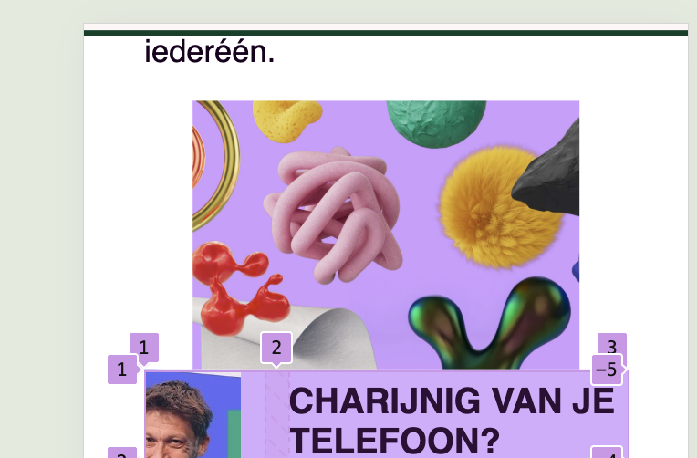
  - De flexbox-opdrachten gingen goed. Grid is nog nieuw voor mij. Voor mijn website heb ik aangegeven welke onderdelen ik met flex ga maken en welke met grid. Soms kan het allebei (bijvoorbeeld header), maar ik probeer zoveel mogelijk grid te gebruiken zodat ik het beter kan leren.
 
   
  -De tabel heeft standaard eigenschappen: sommige elementen krijgen automatisch padding, margin of een border. Op de originele website staat er een underline onder bepaalde delen van de tabel. Dat is daar gedaan met een background-image, maar ik denk dat dit ook prima met een border-bottom opgelost kan worden. In eerste instantie had ik die rijen apart een border-bottom gegeven, maar dat zag er vreemd en onregelmatig uit. Uiteindelijk heb ik het opgelost door alleen de caption en het tbody een border te geven. Zo blijft het ontwerp veel netter en consistenter.

  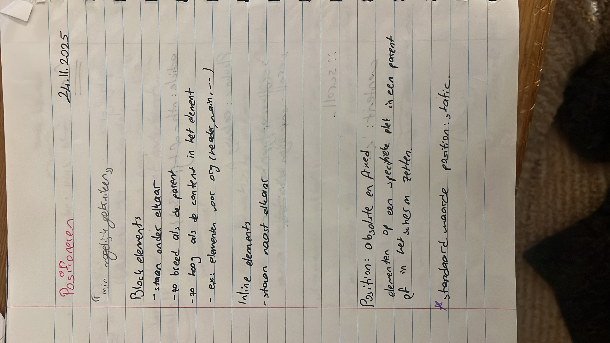 
  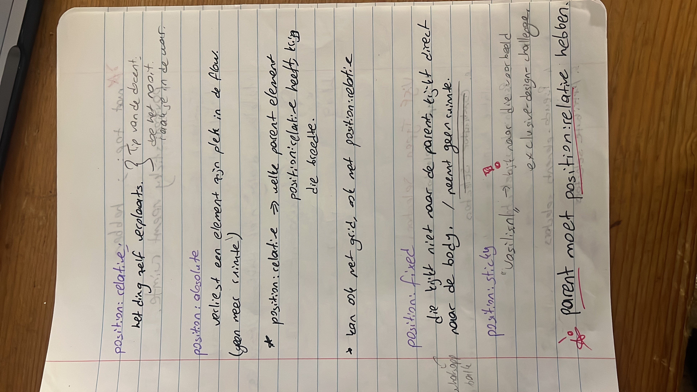 
  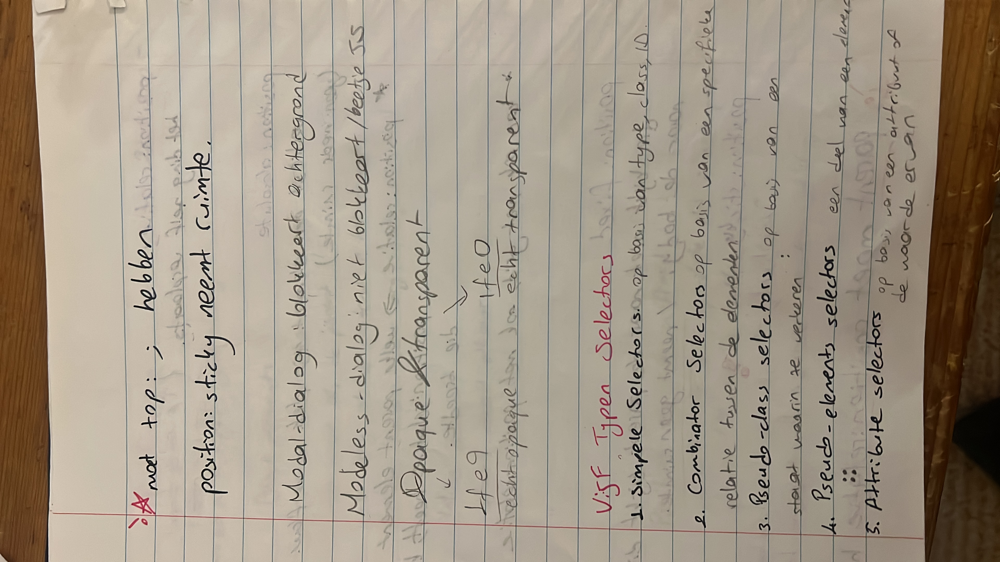 

  ### Agenda voor meeting
  samen met je groepje opstellen

  | Ceren     | student 2          | student 3    | student 4        |
  | ---            | ---                | ---          | ---              |
  | -Label & input  | en dit             | en ik dit    | en dan ik dat    |
  | -Position relative & absolute| dit als er tijd is | nog een punt | dit wil ik zeker |
  | ...            | ...                | ...          | ...              |

  ### Verslag van meeting
  hier na afloop snel de uitkomsten van de meeting vastleggen

  - Belangrijke leerpunt: bij een grid-indeling zoals 1fr auto kijkt de browser eerst naar de auto-breedte, waardoor de andere kolom de resterende ruimte krijgt. Dat vind ik nog lastig om goed in te schatten. Ik moet hier nog verder mee oefenen.
  - Display: inline-block kan helpen met tabel. 
  - Een label en input worden aan elkaar gelinkt via dezelfde id/for. Je kunt de input radio of checkbox visueel verbergen via position:absolute.
  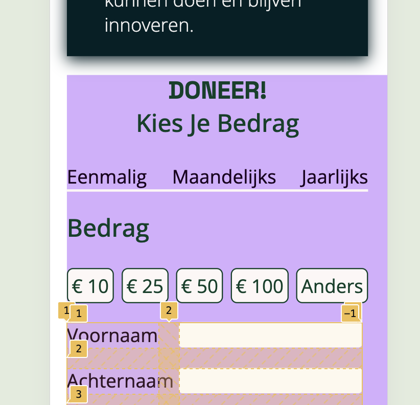 

## Toegankelijkheidstest 2/2 (week 4)

  
uitwerken na test in 9e werkgroep

  ### Bevindingen
  Lijst met je bevindingen die in de test naar voren kwamen (geef ook aan wat er verbeterd is):
  Bevindingen (en verbeteringen)
  - Kleurcontrast: verbeterd. 
  - Titels zijn volledig herschreven naar logische hiërarchie..
  - Skip link: toegevoegd en zichtbaar bij focus.
  - Focus stijt: nu duidelijk zichtbaar en consistent.
  - Alt-teksten: aangevuld en opgeschoond.
  - Formulieren: labels gekoppeld via for en id.
  - Volledige card is niet meer klikbaar voor video's.

## Voortgang 3 (week 4)

  
uitwerken voor 3e voortgang

  ### Stand van zaken
  hier dit ging goed & dit was lastig (neem ook screenshots op van delen van je website en code)
  - Eerst probeerde ik met margin en padding de achtergrondkleur over de volledige pagina te krijgen. Dat werkte niet goed en het brak mijn sticky- en relative-elementen. Omdat ik niet de hele viewport als width had gegeven, heb ik uiteindelijk een ::before gebruikt om de achtergrondkleur te plaatsen. Dat zorgde in het begin voor veel problemen met de responsive layout, maar uiteindelijk heb ik het opgelost door in de media query nieuwe ::before-properities toe te voegen. 
  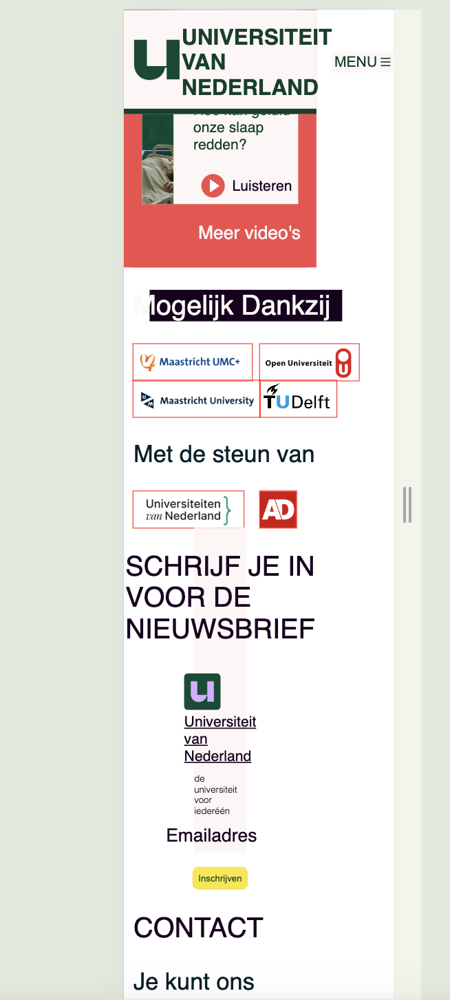
  - Een negatieve margin-top zorgt voor problemen met elementen die position gebruiken, omdat je de natuurlijke flow van de pagina doorbreekt. Hierdoor gaan bijvoorbeeld sticky, absolute of relative elementen onverwacht verschuiven. 
  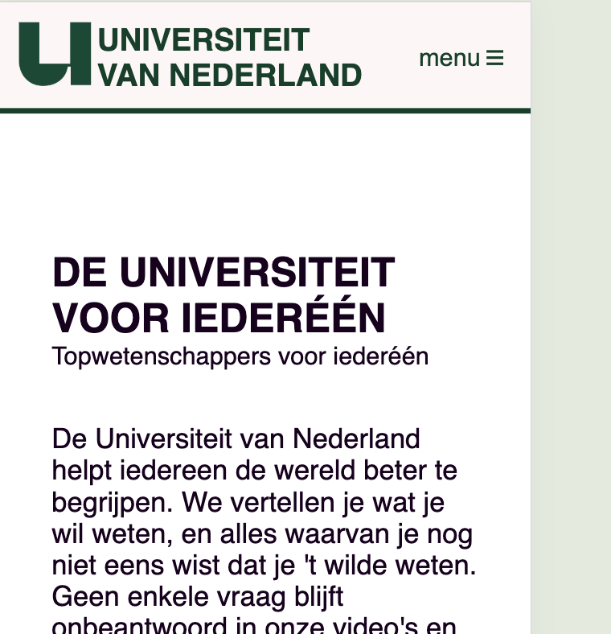 

  ### Agenda voor meeting
  samen met je groepje opstellen

  | student 1      | student 2          | student 3    | student 4        |
  | ---            | ---                | ---          | ---              |
  | dit bespreken  | en dit             | en ik dit    | en dan ik dat    |
  | en dat ook nog | dit als er tijd is | nog een punt | dit wil ik zeker |
  | ...            | ...                | ...          | ...              |

  ### Verslag van meeting
  hier na afloop snel de uitkomsten van de meeting vastleggen

  - Sticky kopjes wil ik in mijn website gebruiken. 

## Eindgesprek (week 5)

  
uitwerken voor eindgesprek

  ### Je uitkomst - karakteristiek screenshots:
  

  ### Dit ging goed/Heb ik geleerd: 
 -media query
 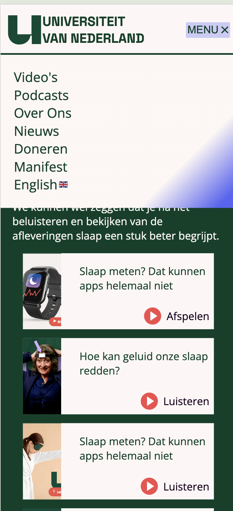
 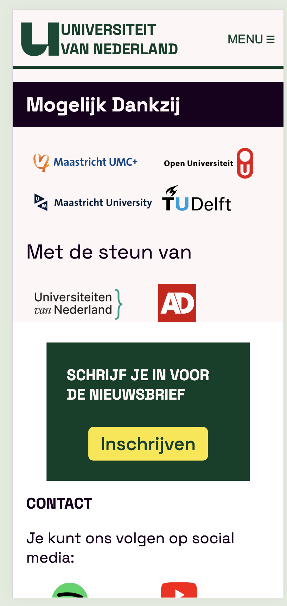
 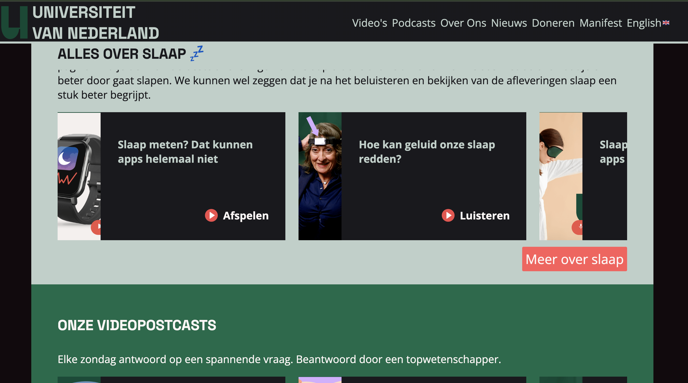
 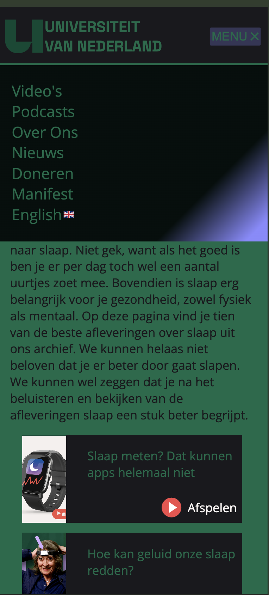
 -extra aandacht met keyframes
  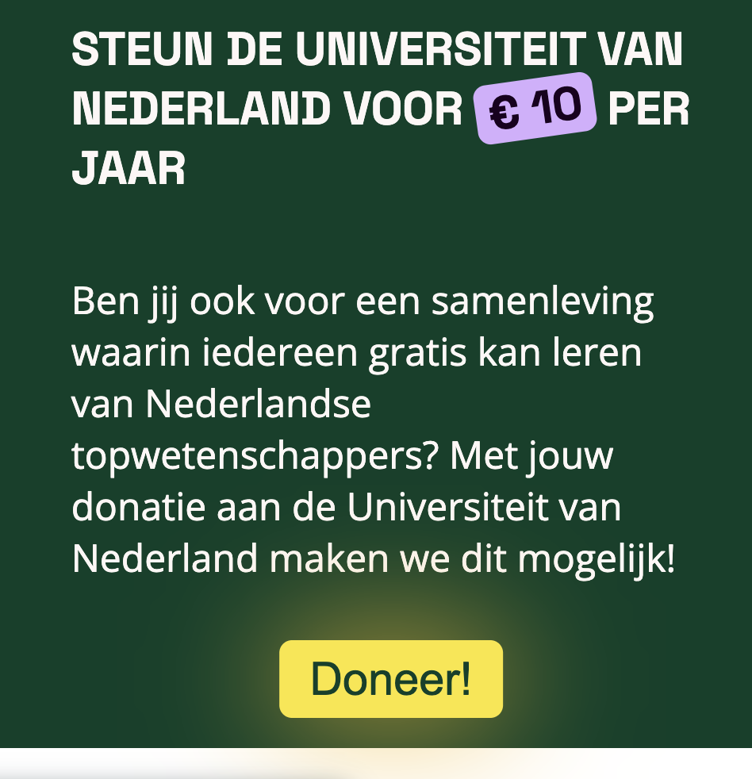

  ### Dit was lastig/Is niet gelukt:
 -Hamburger menu: sticky en relatieve positineren was lastig:
 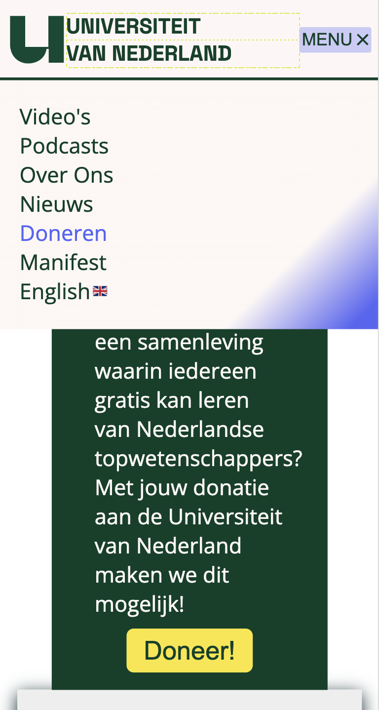
-lasers
 ik heb die laserbeams gecopieerd en geplakt van Codepen
  

## Bronnenlijst

  
continu bijhouden terwijl je werkt

  Nb. Wees specifiek ('css-tricks' als bron is bijv. niet specifiek genoeg). 
  Nb. ChatGpT en andere AI horen er ook bij.
  Nb. Vermeld de bronnen ook in je code.

  1. Lasers: https://codepen.io/Evolution/pen/poGOyM?editors=0110
  2. ChatGPT prompt: 'Ik wil deze code gebruiken in mijn project https://codepen.io/Evolution/pen/poGOyM in de CSS staat de regel @import "compass/css3";. Hoe moet ik dat in mijn eigen project importeren? Moet ik hiervoor veel aanpassen en hoe werkt dit precies?' Kort antwoord: 'Werkt de code nog zonder Compass? In dit specifieke CodePen-voorbeeld: ja, alles werkt al zonder Compass. Waarom? Omdat bijna alle dingen die vroeger via Compass nodig waren (zoals border-radius, box-shadow prefixes) nu standaard in CSS zitten.' 
  3. Schoolopdrachten mbv medestudenten 
  4. https://developer.mozilla.org/en-US/ 'The Table element'
  5. https://www.w3schools.com/css/css_positioning.asp positions oefeningen

